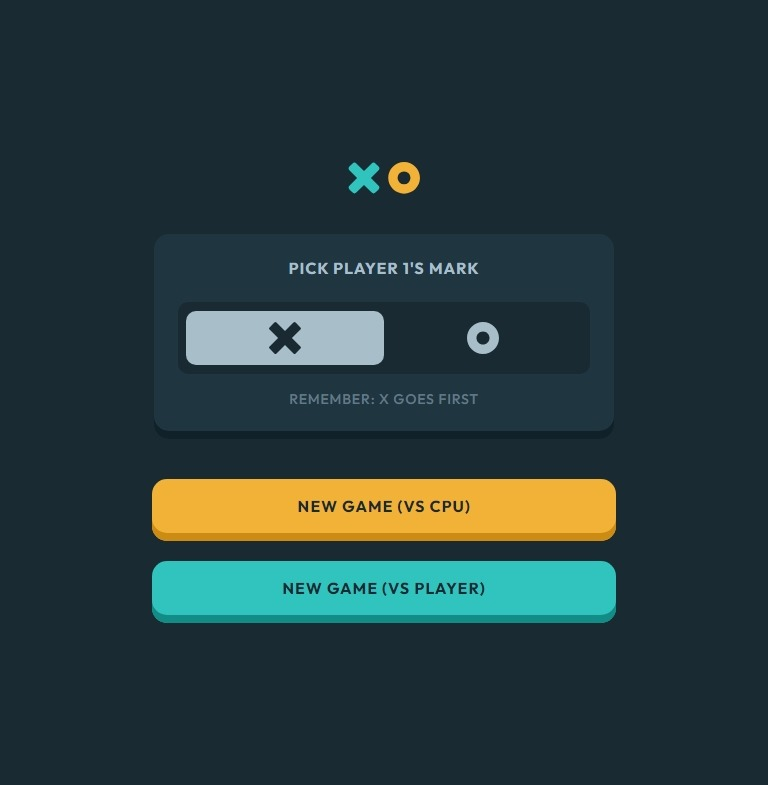
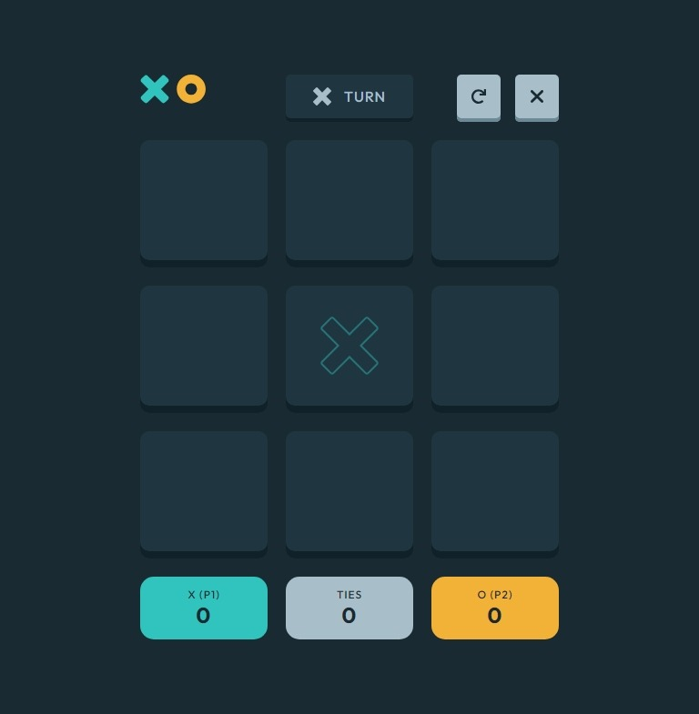

# Frontend Mentor - Tic Tac Toe solution

This is a solution to the [Tic Tac Toe challenge on Frontend Mentor](https://www.frontendmentor.io/challenges/tic-tac-toe-game-Re7ZF_E2v).

## Table of contents

- [Overview](#overview)
  - [The challenge](#the-challenge)
  - [Screenshots](#screenshots)
  - [Links](#links)
- [My process](#my-process)
  - [Built with](#built-with)
- [Author](#author)

## Overview

### The challenge

Users should be able to:

- View the optimal layout for the game depending on their device's screen size
- See hover states for all interactive elements on the page
- Play the game either solo vs the computer or multiplayer against another person
- **Bonus 1**: Save the game state in the browser so that it’s preserved if the player refreshes their browser
- **Bonus 2**: Instead of having the computer randomly make their moves, try making it clever so it’s proactive in blocking your moves and trying to win

### Screenshots

### Links

- Solution URL: [Mobile-first solution using React, SASS and Vite](https://www.frontendmentor.io/solutions/mobile-first-solution-using-react-sass-and-vite-9BJSCneLuA)
- Live Site URL: [Tic Tac Toe](https://azganoth.github.io/tic-tac-toe/)

## My process

- Modified SVG icons to use currentColor and viewBox for better scaling.
- Implemented mid-game quit functionality.
- Added support for Portuguese (Brazil) locale.

### Built with

- HTML5
  - Semantic markup
- CSS3
  - Custom properties
  - Flexbox
  - Grid
- Mobile-first workflow
- [SASS](https://sass-lang.com/) - CSS preprocessor
- [React](https://react.dev/) - JavaScript library
- [Vite](https://vitejs.dev/) - Frontend tooling
- [Vitest](https://vitest.dev/) - Testing framework
- [Testing Library](https://testing-library.com/) - Frontend Testing Library (react)

> [SVGR](https://react-svgr.com/) used to easily import SVG icons as react components.

## Author

- Website - [Ademir José Ferreira Júnior](https://github.com/Azganoth)
- Frontend Mentor - [@Azganoth](https://www.frontendmentor.io/profile/Azganoth)
